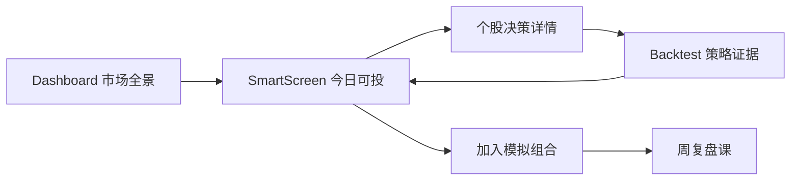

# 04. 页面线框与交互（V1）

## 1. 页面映射

1. `/dashboard`：市场全景（环境标签 + 仓位建议）
2. `/smart-screen`：今日可投（核心决策单）
3. `/backtest`：策略证据与回溯实验

---

## 2. /dashboard 市场全景（低保真）

```text
+----------------------------------------------------------------------------------+
| 顶部: 今日市场状态 [NEUTRAL 56.2]  置信度[中]  建议仓位[30%-50%]                 |
+----------------------------------------------------------------------------------+
| 四象限评分卡                                                                       |
| [趋势 62]   [宽度 51]   [资金 58]   [风险 46]                                     |
+----------------------------------------------------------------------------------+
| 风险提示(2-3条)      | 今日策略建议                                               |
| - 不追高             | - 可参与中等胜率策略                                        |
| - 控制仓位           | - 单票不超过10%                                              |
+----------------------------------------------------------------------------------+
| 市场状态切换历史(近20日): defensive -> neutral -> offensive...                    |
+----------------------------------------------------------------------------------+
```

### 关键交互

1. 点击"策略建议"可跳转 `/smart-screen` 并携带 `state_tag`。
2. 点击"状态历史"中的某一天可查看该日推荐表现（复盘入口）。

---

## 3. /smart-screen 今日可投（核心页，低保真）

```text
+----------------------------------------------------------------------------------+
| 顶栏: 今日可投(3)  市场状态[NEUTRAL]  默认风险[中]  [风险偏好设置]               |
+----------------------------------------------------------------------------------+
| 决策卡 #1 蓝色光标 300058                                                        |
| 动作: [买入]  盈利概率: 64%  风险概率: 22%  置信度: 中                           |
| 入场: 18.20-18.70  止盈: 20.90  止损: 17.30  仓位: 8%                            |
| 理由: [趋势突破回踩] [资金净流入] [样本外命中率高]                                |
| 风险: [板块轮动快] [放量失败]                                                     |
| 按钮: [查看证据] [加入模拟组合] [加入观察]                                        |
+----------------------------------------------------------------------------------+
| 决策卡 #2 ...                                                                     |
+----------------------------------------------------------------------------------+
| 无推荐场景: 今日不交易（原因：防守市 + 信号不足）                                 |
+----------------------------------------------------------------------------------+
```

### 决策详情抽屉（点击"查看证据"）

```text
+-----------------------------------------------------------+
| 个股决策详情                                              |
| 概率定义: P(15日收益>8%) / P(15日回撤>6%)                |
| 分项评分: 趋势/资金/质量/风险                             |
| 失效条件: 跌破止损 / 量能衰减 / 市场状态切换             |
| 策略证据: 样本外胜率、分市场状态表现、近期失效案例        |
| 教学点: 本票的3条可迁移规则                               |
+-----------------------------------------------------------+
```

### 关键交互

1. "加入模拟组合"后写入执行记录，供周复盘使用。
2. "风险偏好设置"会实时重算仓位与推荐排序。
3. 支持切换"简洁模式"（只保留可执行字段，适合上班族）。

---

## 4. /backtest 策略证据与回溯（低保真）

```text
+----------------------------------------------------------------------------------+
| 标签页: [策略证据] [参数实验] [交易明细]                                          |
+----------------------------------------------------------------------------------+
| 策略证据                                                                          |
| 策略: trend_breakout v1.0.3                                                      |
| 指标: 年化 18.6%  回撤 11.9%  夏普 1.24  胜率 58%                                 |
| 分状态表现: offensive / neutral / defensive                                      |
| 曲线: 样本外收益曲线 + 回撤曲线                                                  |
+----------------------------------------------------------------------------------+
| 参数实验                                                                          |
| 参数: 持有天数 / 止盈 / 止损 / 阈值                                               |
| 按钮: [运行回溯]                                                                  |
| 结果: 指标卡 + 敏感性热图 + 对比基准                                              |
+----------------------------------------------------------------------------------+
| 交易明细                                                                          |
| 日期 | 股票 | 买卖 | 价格 | 数量 | 成本 | 触发原因                                |
+----------------------------------------------------------------------------------+
```

### 关键交互

1. 从 `/smart-screen` 进入时自动定位到该推荐对应策略证据。
2. 参数实验结果可"保存为新策略版本"（V1 可先只支持查看）。

---

## 5. 全链路交互流



---

## 6. 组件拆分建议（前端）

1. `MarketStateBanner`（Dashboard/SmartScreen 共用）
2. `PickDecisionCard`（智能筛选核心卡片）
3. `PickEvidenceDrawer`（证据抽屉）
4. `StrategyEvidencePanel`（回溯证据）
5. `WeeklyLessonCard`（复盘教学）

---

## 7. 与现有代码对接建议

1. `frontend/src/pages/Dashboard.jsx`
- 先替换静态数据源，接入 `/api/coach/market-state/today`

2. `frontend/src/pages/SmartScreen.jsx`
- 主表格改为"决策卡模式"（优先移动端可读性）
- 数据源改为 `/api/coach/picks/today`

3. `frontend/src/pages/Backtest.jsx`
- 新增"策略证据"标签页
- 回测任务异步化：`POST run` + `GET result`
